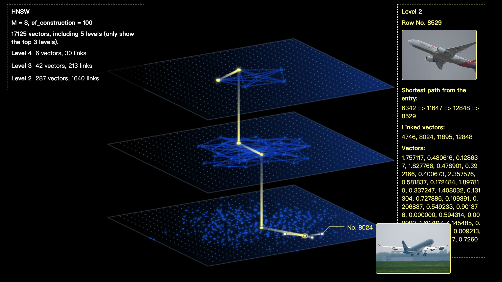

# feder

## What is feder

Feder is built for visualizing anns index files, so that we can have a better understanding of anns and high dimensional vectors. so far, we are focusing on the index from Faiss (only ivf_flat) and HNSWlib (hnsw), we will cover more index types later.

- HNSW
  

## Quick start

### installation

Use npm or yarn.

```shell
#install
npm install @zilliz/feder
```

or

```shell
#install
yarn add @zilliz/feder
```

### Material Preparation

Make sure that you have Built an index and dumped the index file by Faiss or HNSWlib.

### Init Feder

Specifying the dom container that you want to show the visualizations.

```js
import { Feder } from '@zilliz/feder';

const feder = new Feder({
  filePath: 'faiss_file', // file path
  source: 'faiss', // faiss | hnswlib
  domSelector: '#container', // attach dom to render
  viewParams: {}, // optional
});
```

### Visualize the index structure.

- HNSW - Feder will show the top-3 levels of the hnsw-tree

```js
feder.overview();
```

### Explore the search process.

Set search parameters (optional) and Specify the query vector.

```js
feder.setSearchParams({ k: 8, ef_search: 100 }); // hnsw
feder.setSearchParams({ k: 8, nprobe: 8 }); // ivf_flat
feder.search(target_vector);
```

### Advanced

Use **viewParams** to adjust the details of the view.

```js
const feder = new Feder({
  filePath,
  source: 'hnswlib',
  domSelector,
  viewParams: {
    width: 1000,
    height: 600,
    padding: [80, 200, 60, 220],
    mediaType: 'img',
    mediaCallback: (rowId) => url,
  },
});
```

#### view style

Specify the visual style of the view.

- width - canvas width
- height - canvas height
- padding - the main view padding

#### media supports

Support mapping from Row No. to media files. (current support img)

- mediaType - null | img
- mediaCallback - func: rowId => url,

## Examples

We prepare a simple case, which is an overview of an hnsw with 17,000+ vectors.
Only need enable a web service and open 'http://localhost:8000/'.

```shell
git clone git@github.com:zilliztech/feder.git
cd test
python -m http.server
```

If you want to explore the search process of hnsw, you can modify **test/test.js**.

**searchRandTestVec** will randomly select a vector from the index file as the target vector.

```js
window.addEventListener('DOMContentLoaded', async () => {
  ...
  // feder.overview();
  feder.searchRandTestVec();
  ...
});
```
then open a new cmdline, 
```shell
yarn dev
```
It makes the new changes to test.js take effect.

If you want to display the image during the interaction, need to [download the vectors dataset (csv)](https://assets.zilliz.com/voc_vectors_e8ec5a5eae.csv), rename it as "voc_vectors.csv", and put it to "test/data/".

Then you can modify **test/test.js**, and use the **testHNSWWithImages** function.

```js
window.addEventListener('DOMContentLoaded', async () => {
  ...
  // const feder = await testHNSW(
  //   'https://assets.zilliz.com/hnswlib_hnsw_voc_17k_1f1dfd63a9.index'
  // );
  const feder = await testHNSWWithImages(
    'https://assets.zilliz.com/hnswlib_hnsw_voc_17k_1f1dfd63a9.index'
  );
  ...
});
```

If you want to use a new dataset, the following process will help you.

## Explore a new data

### Step 1. Dataset preparation

Put all images to **test/data/images/**. (example dataset [VOC 2012](http://host.robots.ox.ac.uk/pascal/VOC/voc2012/VOCtrainval_11-May-2012.tar))

You can also generate random vectors without embedding for index building and skip to **step 3**.

### Step 2. Generate embedding vectors

Recommend to use [towhee](https://github.com/towhee-io/towhee), one line of code to generating embedding vectors!

We have the encoded vectors ([download](https://assets.zilliz.com/voc_vectors_e8ec5a5eae.csv)) ready for you. 

### Step 3. Build an index and dump it.

You can use [faiss](https://github.com/facebookresearch/faiss) or [hnswlib](https://github.com/nmslib/hnswlib) to build the index.

(\*Detailed procedures please refer to their tutorials.)

Referring to **test/data/gen_hnswlib_index_*.py** or **test/data/gen_faiss_index_*.py**

Or we have the index files ([download](https://assets.zilliz.com/hnswlib_hnsw_voc_17k_1f1dfd63a9.index)) ready for you. 

### Step 4. Init Feder.

```js
import { Feder } from '@zilliz/feder';
import * as d3 from 'd3';

const domSelector = '#container';
const filePath = [index_file_path];

const mediaCallback = (rowId) => mediaUrl;

const feder = new Feder({
  filePath,
  source: 'hnswlib',
  domSelector,
  viewParams: {
    mediaType: 'img',
    mediaCallback,
  },
});
```

If use the random_data, no need to specify the mediaType.

```js
import { Feder } from '@zilliz/feder';
import * as d3 from 'd3';

const domSelector = '#container';
const filePath = [index_file_path];

const feder = new Feder({
  filePath,
  source: 'hnswlib',
  domSelector,
});
```

### Step 5. Explore the index!

Visualize the overview

```js
feder.overview();
```

or

```js
feder.search(target_vector);
```

or

```js
feder.searchRandTestVec();
```


## Join us

Welcome to Zilliz!

## Acknowledgments

- [faiss](https://github.com/facebookresearch/faiss)
- [hnswlib](https://github.com/nmslib/hnswlib)
- [d3](https://github.com/d3/d3)
